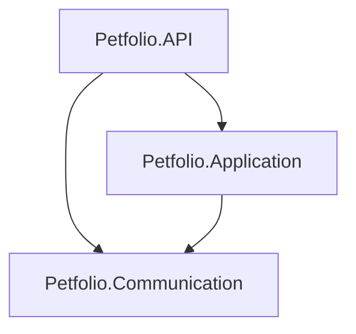

# 🐾 Projeto Petfolio - Configuração Inicial, Arquitetura e Swagger

Este documento registra o passo a passo da aula "Iniciando o projeto Petfolio", focado na criação da estrutura da solução, separação de responsabilidades e configuração da documentação com Swagger no Visual Studio 2022 e .NET 8.

## 🎯 Objetivo
Criar uma API para gerenciamento de um portfólio de pets, estruturada em camadas para organizar responsabilidades (Business Logic, DTOs e API) e documentada automaticamente.

---

## 1. Criação da Solução (Solution)
O primeiro passo é criar um container vazio para agrupar nossos projetos.

1. Abra o **Visual Studio 2022**.
2. Selecione **"Create a new project"**.
3. Busque por **"Blank Solution"**.
4. Configure:
   - **Name:** `Petfolio`
   - **Location:** `C:\Workspace\Petfolio` (ou sua pasta de preferência).

---

## 2. Estrutura dos Projetos
A solução foi dividida em três projetos distintos:

### A. Projeto da API (`Petfolio.API`)
Responsável por ser a porta de entrada da aplicação.
1. Clique com botão direito na Solution > **Add** > **New Project**.
2. Selecione **"ASP.NET Core Web API"** (C#).
3. **Name:** `Petfolio.API`.
4. **Framework:** .NET 10.0.
5. **Limpeza:** Delete os arquivos `WeatherForecast.cs` e `Controllers/WeatherForecastController.cs`.
6. **Configuração:** Clique com botão direito no projeto > **"Set as Startup Project"**.

### B. Projeto de Comunicação (`Petfolio.Communication`)
Responsável pelas classes de Requisição e Resposta (DTOs). É uma biblioteca de classes pura, focada em dados.
1. Clique com botão direito na Solution > **Add** > **New Project**.
2. Selecione **"Class Library"** (C#).
3. **Name:** `Petfolio.Communication`.
4. **Limpeza:** Delete a `Class1.cs`.

### C. Projeto de Aplicação (`Petfolio.Application`)
Responsável por conter as Regras de Negócio (Business Logic).
1. Clique com botão direito na Solution > **Add** > **New Project**.
2. Selecione **"Class Library"** (C#).
3. **Name:** `Petfolio.Application`.
4. **Limpeza:** Delete a `Class1.cs`.

---

## 3. Gerenciamento de Dependências (References)
Configuração crucial para que os projetos se enxerguem sem criar **Dependência Cíclica**.

### Diagrama de Dependência

## 🧩 Camada de Aplicação (Application Layer)

Nesta camada residem as **Regras de Negócio**. Utilizamos o padrão **Use Case** (Caso de Uso), onde cada classe tem a responsabilidade única de executar uma ação específica do sistema.

### Classe: `RegisterPetUseCase`
Responsável por orquestrar o processo de cadastro de um novo pet.

* **Entrada:** Recebe um `RequestRegisterPetJson` (definido na camada *Communication*).
* **Saída:** Retorna um `ResponseRegisterPetJson` (definido na camada *Communication*).
* **Comportamento:**
    1. Recebe os dados da API.
    2. (Futuro) Validará as regras de negócio.
    3. (Futuro) Salvará no Banco de Dados.
    4. Retorna a confirmação com o ID criado.
#F87